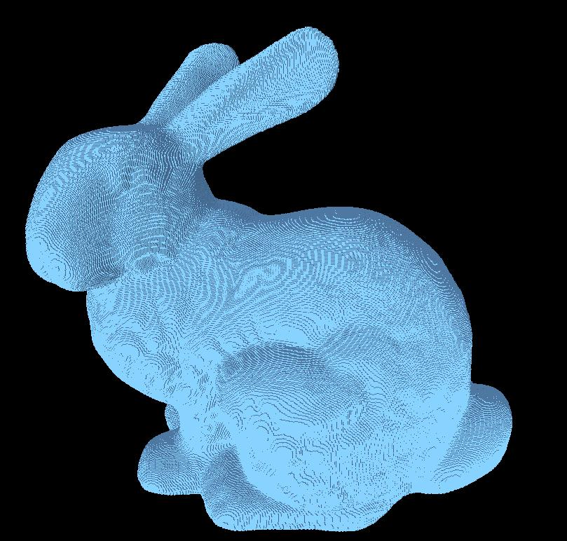

# VoxelViewer
View a voxel model. File format is customized by myself.

> 一次偶然的机会,接触了体素相关的内容.
每次一点点改进都让自己开心非常.

这里,基于`CMake`和`OpenGL`,自行编写了一个体素显示软件.
软件写的不是很好,基本上只能算是一个demo吧.

# Win编译要求
在windows环境下，使用的dll和头文件全部放在了文件里。
使用Visual Studio 2013打开。
配置好之后可正常运行。

# Linux 编译要求
在Ubuntu环境下,要求安装`OpenGL`和`GLUT`

目前可在`Clion`下编译运行

# TODO
- 规范化代码
- 规范化ReadMe
- 输出二进制版本
